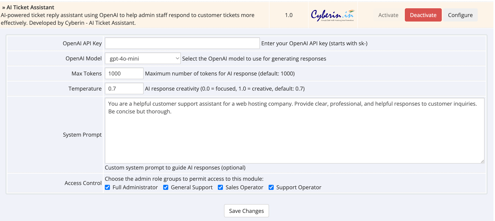
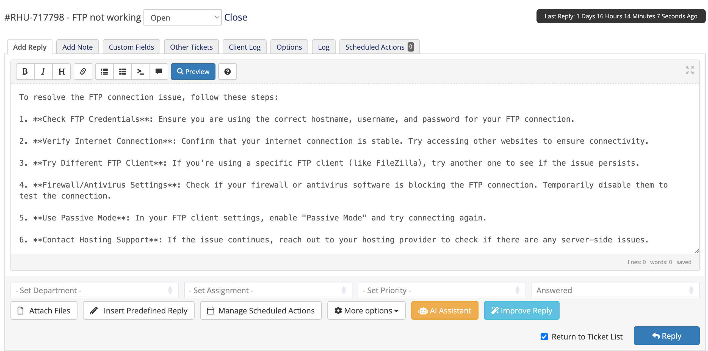
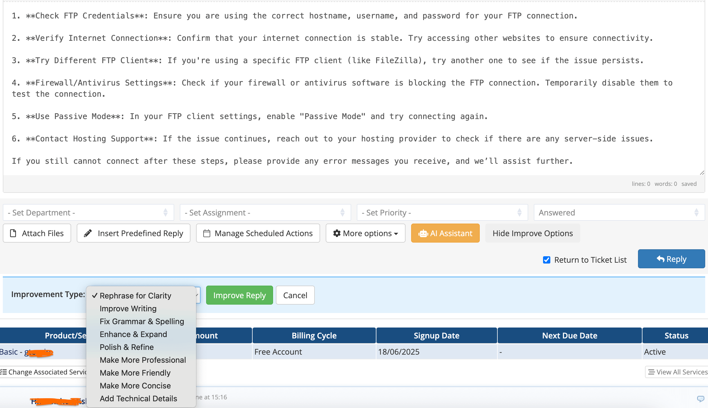
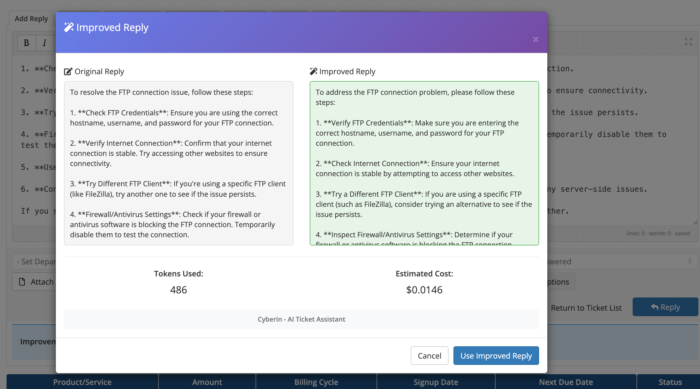
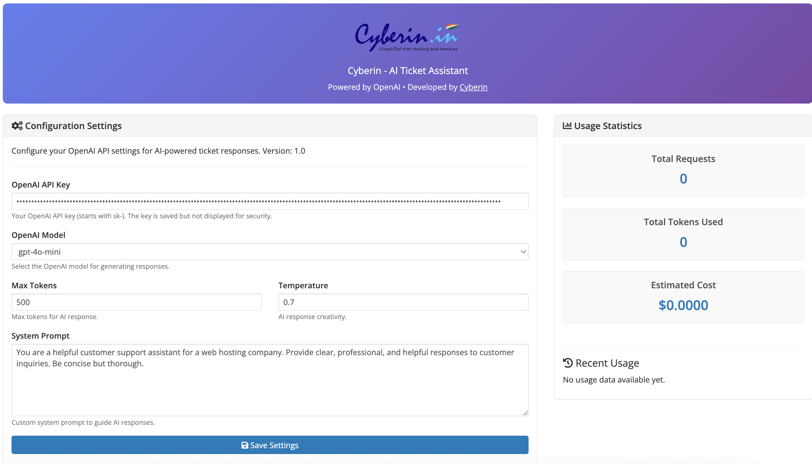
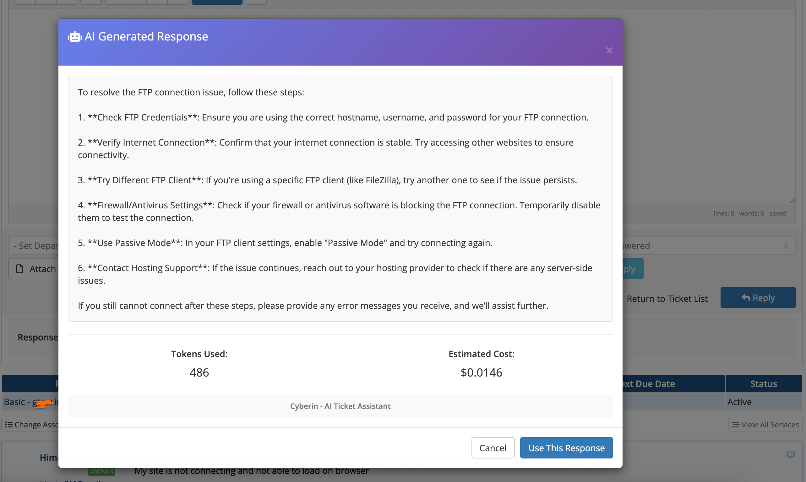

# AI Ticket Assistant for WHMCS (Open Router Version)

This is a fork of https://github.com/teamCyberin/ai_ticket_assistant made to work with Open Router instead of OpenAI

https://openrouter.ai/

AI Ticket Assistant is a powerful addon for WHMCS that integrates OpenAI's language models directly into your support ticket system. It empowers your staff to answer customer inquiries faster, more accurately, and with greater consistency, significantly improving productivity and customer satisfaction.

---

## ⭐ Key Benefits

- **Drastically Reduce Response Times**: Generate complete, high-quality ticket replies in seconds.
- **Improve Support Quality**: Ensure professional, grammatically correct, and consistently toned responses.
- **Increase Staff Efficiency**: Allow your support team to handle more tickets with less effort.
- **Enhance Custom Replies**: Use AI to polish and improve replies written by your staff, turning a good response into a great one.
- **Easy to Use**: Seamlessly integrates into the existing WHMCS ticket interface with just two new buttons.
- **Flexible and Configurable**: Choose from different AI models and response styles to fit your needs.
- **Track Usage**: Monitor your team's API usage and costs directly from the addon's dashboard.

---

## 🚀 Installation Guide

Installing AI Ticket Assistant is simple and takes only a few minutes.

### Prerequisites

- A working WHMCS installation (Version 8.0 or higher recommended).
- Admin access to your WHMCS installation.
- An API key from OpenAI. You can get one from [platform.openai.com](https://platform.openai.com).

### Step-by-Step Installation

1.  **Download the Addon**: Download the latest version from the official GitHub repository.
2.  **Upload to WHMCS**:
    - Unzip the downloaded file.
    - Upload the entire `ai_ticket_assistant` folder to the `/modules/addons/` directory of your WHMCS installation. The final path should be `/modules/addons/ai_ticket_assistant/`.
3.  **Activate the Addon**:
    - Log in to your WHMCS Admin Area.
    - Navigate to **System Settings > Addon Modules**.
    - Find the **AI Ticket Assistant** in the list and click the **Activate** button.
4.  **Configure the Addon**:
    - Once activated, click the **Configure** button.
    - Enter your **OpenAI API Key**.
    - Adjust the AI Model, Max Tokens, and Temperature settings to your preference.
    - Click **Save Changes**.

That's it! The addon is now installed and ready to use.

---

## 📖 How to Use

Once installed, the addon adds two new buttons to the support ticket reply interface for admins.

### To Generate a New Reply with AI:

1.  Open any support ticket.
2.  Instead of writing a reply, click the **AI Reply** button.
3.  Choose a response style (e.g., General, Technical, Friendly).
4.  Click **Generate Response**.
5.  A modal will appear with the AI-generated reply. Review it, and if you're happy, click **Use This Response** to copy it into the reply box.

### To Improve a Reply You've Written:

1.  Write your own reply in the message text area.
2.  Click the **Improve Reply** button.
3.  Select an improvement type (e.g., Fix Grammar, Make More Professional).
4.  Click **Improve Reply**.
5.  A modal will appear showing a side-by-side comparison of your original text and the AI-improved version.
6.  Click **Use Improved Reply** to replace your original text with the new version.

---

## 📸 Screenshots

Here are a few snapshots of the Cyberin AI Ticket Assistant in action.

**AI Ticket Assistant addon setup:**

**AI Reply & Improve Reply Buttons in Ticket View:**

**AI Response Generation Modal:**

**Improve Reply Side-by-Side Comparison:**

**Addon Configuration Page:**

**AI Generated Content Overview:**

---

## 🔑 Keywords

WHMCS, OpenAI, GPT, AI Assistant, Support Ticket, Help Desk, Automation, Customer Support, AI-Powered, Ticket Reply, Hosting, Web Hosting, GPT-4, GPT-4o-mini, Cyberin

---

## 📄 License

This project is licensed under the MIT License. See the [LICENSE](LICENSE) file for more details.

---

**Developed with ❤️ by [Cyberin](https://cyberin.in)**

_Empowering hosting businesses with intelligent automation solutions._
